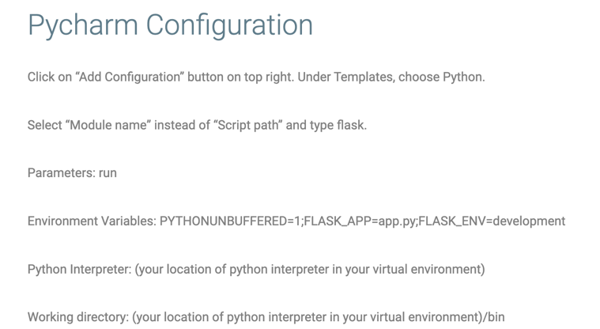
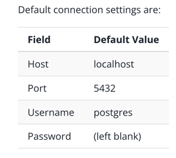
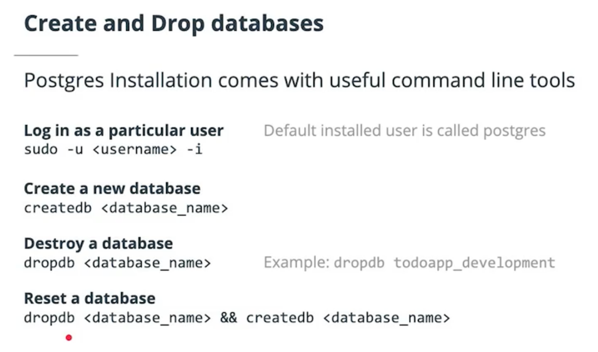

## Development Setup
### Run the app
1. **Download the project starter code locally**
```
git clone https://github.com/udacity/FSND.git
cd FSND/projects/01_fyyur/starter_code
```

2. **Create an empty repository in your Github account online. To change the remote repository path in your local repository, use the commands below:**
```
git remote -v 
git remote remove origin 
git remote add origin <https://github.com/<USERNAME>/<REPO_NAME>.git>
git branch -M master
```
Once you have finished editing your code, you can push the local repository to your Github account using the following commands.
```
git add . --all   
git commit -m "your comment"
git push -u origin master
```

3. **Initialize and activate a virtualenv using:**
```
python -m virtualenv env
source env/bin/activate
```
>**Note** - In Windows, the `env` does not have a `bin` directory. Therefore, you'd use the analogous command shown below:
```
source env/Scripts/activate
```

4. **Install the dependencies:**
```
pip install -r requirements.txt
```

5. **Run the development server:**
```
export FLASK_APP=app
export FLASK_ENV=development # enables debug mode
python3 app.py or flask run
```

6. **Verify on the Browser**<br>
Navigate to project homepage [http://127.0.0.1:5000/](http://127.0.0.1:5000/) or [http://localhost:5000](http://localhost:5000) 

7. **Config run/debug with Pycharm Community**

Ref [Configure Pycharm Community Edition to run Flask](https://tekshinobi.com/configure-pycharm-community-edition-to-run-flask/)

- FLASK_DEBUG=1 helps you for hot reloading. When you change your code and save. The flask server will restart with new modified code.

### Database

```buildoutcfg
$ which postgres

/usr/local/bin/postgres
```

- Start server
```buildoutcfg
$ pg_ctl -D /opt/homebrew/var/postgres start

waiting for server to start....2022-07-15 15:20:12.701 +07 [93899] LOG:  starting PostgreSQL 14.2 on aarch64-apple-darwin21.3.0, compiled by Apple clang version 13.0.0 (clang-1300.0.29.30), 64-bit
2022-07-15 15:20:12.703 +07 [93899] LOG:  listening on IPv6 address "::1", port 5432
2022-07-15 15:20:12.703 +07 [93899] LOG:  listening on IPv4 address "127.0.0.1", port 5432
2022-07-15 15:20:12.703 +07 [93899] LOG:  listening on Unix socket "/tmp/.s.PGSQL.5432"
2022-07-15 15:20:12.706 +07 [93900] LOG:  database system was shut down at 2022-07-15 15:13:07 +07
2022-07-15 15:20:12.711 +07 [93899] LOG:  database system is ready to accept connections
 done
server started
```

- Stop server
```buildoutcfg
$ pg_ctl -D /opt/homebrew/var/postgres stop

waiting for server to shut down...2022-07-15 15:20:39.331 +07 [93899] LOG:  received fast shutdown request
.2022-07-15 15:20:39.332 +07 [93899] LOG:  aborting any active transactions
2022-07-15 15:20:39.333 +07 [93899] LOG:  background worker "logical replication launcher" (PID 93906) exited with exit code 1
2022-07-15 15:20:39.333 +07 [93901] LOG:  shutting down
2022-07-15 15:20:39.353 +07 [93899] LOG:  database system is shut down
 done
server stopped
```
- Using the database
```buildoutcfg
$ psql postgres

psql (14.2)
Type "help" for help.

postgres=# 
```


