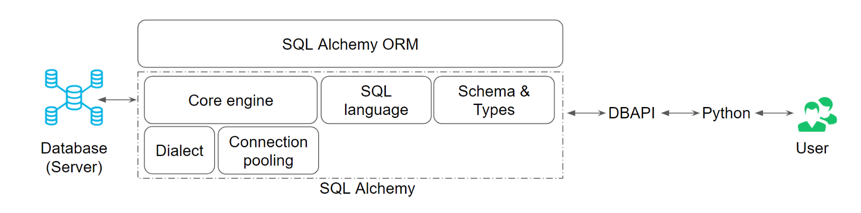

# SQL Alchemy
A library in Python that can enable effective and efficient DB interaction for your app.
- SQLAlchemy is the most popular open-source library for working with relational databases from Python.
- It is one type of ORM library, AKA an Object-Relational Mapping library, which provides an interface for using object-oriented programming to interact with a database.

## Advantages
- Features function-based query construction: allows SQL clauses to be built via Python functions and expressions.
- Avoid writing raw SQL. It generates SQL and Python code for you to access tables, which leads to less **database-related overhead** in terms of the volume of code you need to write overall to interact with your models.
- Moreover, you can avoid sending SQL to the database on every call. The SQLAlchemy ORM library features automatic caching, caching collections, and references between objects once initially loaded.

## Keys
- How the components of SQL Alchemy and ORM are structured
- What are dialects 
- What is a connection pool 
- How does the core engine work 
- How classes and tables are mapped 
- How models are defined 
- How data types are handled 
- How to define constraints